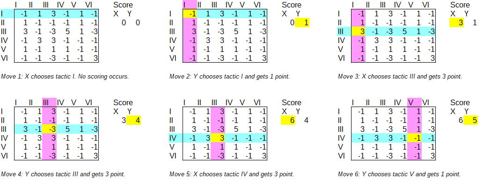
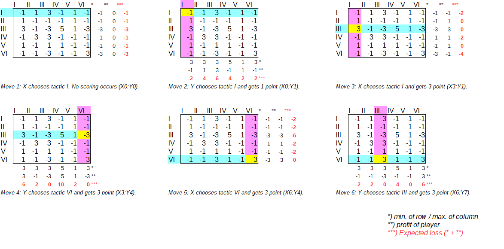

# How to play Duel by Xenakis

## Duel is a sequential game

> 1. Simulate the game, i.e., mentally substitute oneself for the two conductors, X and Y, by following the matrix entries stage by stage, [...]
> (Formalized Music, p.117)

- Player X and Y execute tactics alternately.
- The score is at the intersection of the tactics of X and Y on the game matrix.
- Positive numbers are X's score, negative numbers are Y's score.

## What strategies are available?

- Arbitrary choice of tactics (p.123)

- Mixed strategy = weighted random

Drawing lots according to the ratio of mixed strategies.
For example, conductor X draws lots with 14 cards of tactic I, 6 cards each of II, III, and IV, 8 cards of V, and 16 cards of VI. (p.126, M6)

- Decide the order of performance in advance. (p.123)

### Problems with the above strategies

1. The above strategies can be done without the game matrix.

Mixed strategy is the probabilistic use of various tactics in a **simultaneous game** where the strategy is not fixed.
For example, the mixed strategy of rock-paper-scissors is "to make all moves with a 1/3 chance each."

There is no point in having a game matrix because you can do it by looking at the probability table without looking at the game matrix.

> For such a full-information game estimating the mixed strategy doesn't make sense as there should be an optimal strategy (although finding it would require even more computation).
> http://musicgames.wikidot.com/book:xenakis-formalized-music#formalized-music

2. It is not a real strategy game.

> e. Actually all these ways constitute what one may call "degenerate" competitive situations. The only worthwhile setup, which adds something new in the case of more than one orchestra, is one that introduces dual conflict between the conductors. In this case the pairs of tactics are per- formed simultaneously without interruption from one choice to the next (see Fig. IV-4), and the decisions made by the conductors are conditioned by the winnings or losses contained in the game matrix.
> (p.126)

### Strategies based on the game matrix

1. Get the maximum profit

On the first move, X randomly chose tactic I. Since there is no opponent's tactic, no score is generated.
On the second move, Y chose tactic I and gained a point.
In the same way, the players choose the tactic which gains immediately maximum profit.

2. Minimax Strategy

Minimize the losses caused by the opponent's next move.

If X chooses tactic I on the first move, Y gets a point for choosing tactic I, IV, or VI, in the second move. This means that the expected damage of tactic I for X is -1 in this case.
If X chooses Tactic III on the first move, Y gets 3 points for choosing Tactics III and VI, in the second move. In other words, the expected damage of tactic III for X is -3 in this case.
X should choose the tactic with the least expected damage. It would be strategy I, II, IV, or V.

In the second move, the expected damage of Y is the maximum value of each column plus the profit of Y (negative numbers).
If X chooses tactic I on their first move, Y will get 1 point if they chooses tactic I in the second move, but X can get 3 points on their third move. So the expected loss for Y is 3+(-1)=2 points.
In the same case, when Y chooses tactic IV, Y will get a point as well, but X will get 5 points on the third move. So the expected loss for Y is 5+(-1)=4 points.

In this way, the player should anticipate the opponent's moves.
In order to anticipate the next few moves, it would be necessary to analyze game with game trees.
But it is so complicated, so we will not do it this time.

## Are games fair? - Simulations of each strategy

The purpose of a classic board game such as chess would not be to discover a winning strategy.
Computers compute games, but humans play games.
Since finding the optimal strategy has to do with winning the game, it should be done in actual games.
However, a game that is significantly out of balance will reduce the motivation of the players.
Therefore, the game designer should show that the game is somewhat fair.

## The game matrix generates musical structure

## Proposal
