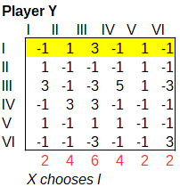
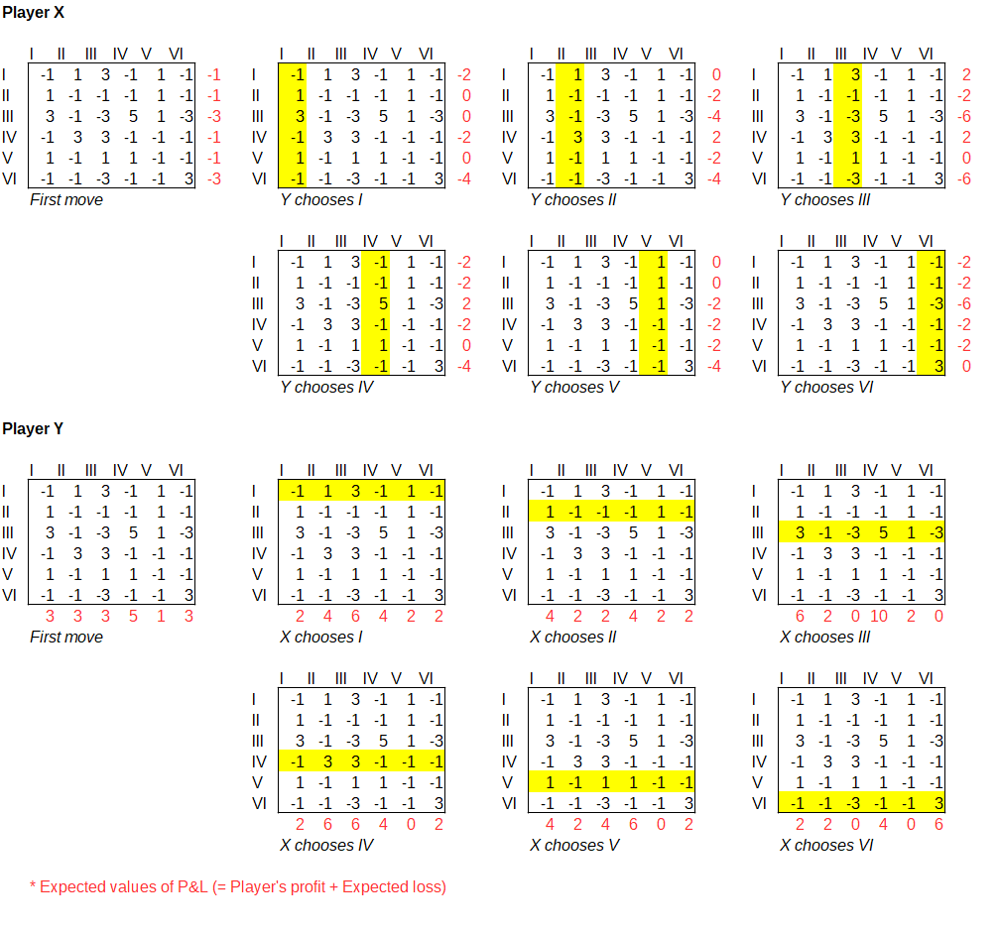
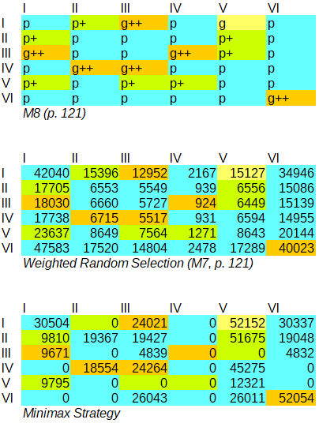

Game theory deals with the problem of decision-making involving multiple players.
In game theory, games can be classified into two types.
They are simultaneous games and sequential games.
In a simultaneous game, all players execute their tactics simultaneously.
Therefore, a player cannot know in advance the tactics of the other players.
For example, Rock-paper-scissors is a simultaneous game.

<!--
ゲーム理論は、複数の主体が関わる意思決定の問題を扱う。
ゲーム理論において、ゲームは2種類に分類できる。
simultaneous gameとsequential gameである。
simultaneous gameにおいて、全てのプレイヤーは同時に戦術を実行する。
そのため、プレイヤーは他のプレイヤーの戦術を事前に知ることはできない。
例えばRock–paper–scissorsはsimultaneous gameである。
-->

In a sequential game, players execute their tactics one by one in turn. Therefore, a player acts after they know the tactics of the other players. Xenaki's composition "Duel" models a game for two players. It is written for two conductors named X and Y, conducting two separate orchestral ensembles, where each conductor acts represents a player. In Duel, the two conductors (players) choose tactics by taking turns sequentially, i.e. Duel is a sequential game. The implementation part of the present paper gives an implementaiton of the algorithm for taking turn in a game for two players (see section ... below). 

<!--
sequential gameにおいて、プレイヤーは一人ずつ順番に戦術を実行する。
そのため、プレイヤーは他のプレイヤーの戦術を知った後で行動する。
Duelは、2人の指揮者（プレイヤー）が交互に戦術を選択する。
従ってsequential gameと定義できる。
-->

The score of Duel consists of 6 sections of distinct character.  The sonic characteristics of these sections are described by Xenakis both in the score of the piece and in the discussion of the piece in FM (p...). When taking turns in the game, each conductor/player chooses amongst one of the 6 sections and asks their own ensemble to play it.  Thus, these 6 sections of the score constitute the 6**tactics** of the game.  The tactics are named by the latin numerals I, II, III, IV, V, VI.

Xenakis notes the conditions under which the game ends.
According to Duel's performance notes, the game will finish in the following cases:

- When a certain number of tactics have been executed
- When one of the players reaches a predetermined score
- When the time limit is reached

However, the actual finish condition is optional, and the players can continue the game indefinitely.
Therefore, in game theory terms Duel can be defined as an Infinite sequential game.

<!--
加えて、クセナキスはゲームの終了条件について記している。
Duelのパフォーマンスノートによると、以下の場合にゲームは終了する。
- 一定の数の戦術が選択された場合
- どちらかのプレイヤーが事前に決められた得点に達した場合
- 制限時間に達した場合
とはいえ実際の終了条件は任意であり、無限に続けることもできる。
そのためDuelは、ゲーム理論の用語ではInfinite sequential gameと定義できる。
-->

In addition to the conditions for ending the game, Xenakis also describes several strategies that can be used by the conductors/players in order to choose the next tactic when they are taking turns. 

[...]

The main strategy on which Xenakis focusses is that of a matrix representing the gains or losses of the two players for each combination of tactics chosen at any time.  In this matrix, each combination of moves of X and Y, corresponds to a cell which gives the **gain of X and the loss of Y**. 

For example, if X chooses I and Y chooses III then the gain of 

The reference matrix for the discussion in the present paper is M7 (FM p. 121). The game matrix 

What catches our eye in the score of Duel is the 6x6 game matrix (payoff matrix).
The matrix is made up of positive or negative integers.
In general, a payoff matrix is written as follows.

<!--
Duelのスコアで我々の目を引くのは6x6のゲーム行列（payoff matrix）である。
その行列は正または負の整数から出来ている。
一般的に、payoff matrixは次のように表記される。
-->

|  | Rock | Paper | Scissors |
| :--- | :--: | :--: | :--: |
| Rock | 0:0 | -1:1 | 1:-1 |
| Paper | 1:-1 | 0:0 | -1:1 |
| Scissors | -1:1 | 1:-1 | 0:0 |

Of the number pairs, the left shows Player X's profit and loss (P&L), and the right shows Player Y's P&L.
The sum of the P&Ls of X and Y is always zero.
Therefore, Rock-paper-scissors is a zero-sum game.
Since rock-paper-scissors is a zero-sum game, its payoff matrix can be succinctly expressed as follows.

<!--
数のペアのうち、左はプレイヤーXの損益(P&L)、右はプレイヤーYのP&Lを示す。
XとYのP&Lの合計は常に0である。
よってRock–paper–scissorsはゼロサムゲームである。
Rock–paper–scissorsはゼロサムゲームであるので、そのpayoff matrixは次のように簡潔に表記できる。
-->

|  | Rock | Paper | Scissors |
| :--- | :--: | :--: | :--: |
| Rock | 0 | -1 | 1 |
| Paper | 1 | 0 | -1 |
| Scissors | -1 | 1 | 0 |

A positive number is a profit for X, and at the same time, it means a loss for Y.
A negative number is a loss for X, and at the same time, it means profit for Y.
In short, Duel is also a zero-sum game.

<!--
正数はXの利益である。そして同時にYの損失を意味する。
負数はXの損失である。そして同時にYの利益を意味する。
要するにDuelもまたゼロサムゲームである。
-->

A payoff matrix is an analysis tool for simultaneous games.
In general, sequential games are analyzed using game trees.
Because the player's situation is not constant, but changes every time.
Xenakis treats the payoff matrix itself as a kind of game board.
In an actual game, player X's choices affect Y's choices, and Y's choices affect X's choices again.
So the game forms a feedback loop.
It is why each player's situation is constantly changing.

<!--
実はpayoff matrixはsimultaneous gameの分析ツールである。
一般的にsequential gameはgame treeを用いて分析される。
プレイヤーの状況が一定ではなく、毎回変化するためである。
クセナキスは、payoff matrixそれ自体を一種のゲーム盤として扱っている。
実際のゲームでは、プレイヤーXの選択がYの選択に影響を与え、Yの選択が再びXの選択に影響を与える。
言わばゲームはフィードバックループを形成する。
そのために各プレイヤーの状況は常に変化する。
-->

Check the payoff matrix of Duel.
In the first move of the game, with the opponent's tactics still undecided, which tactic should Player X choose?
For example, suppose that X and Y both adopt a minimax strategy.
The minimax strategy is adopting the tactic that will result in the least expected losses for the player oneself.

<!--
Duelのpayoff matrixで確認しよう。
ゲームの第一手、つまり対戦相手の戦術がまだ決まっていない状態で、プレイヤーXはどの戦術を選ぶべきか？
例えば、XとYは共にミニマックス戦略を採ると仮定する。
ミニマックス戦略とは、自分の未来の損失が最も少なくなる戦術を採用する戦略だ。
-->

Let's remember that Duel is a zero-sum game.
A negative number means a loss for X and a profit for Y simultaneously.
On the next move, Y can profit by choosing the smallest value from the row X has selected.
And at the same time, Y can cause the same amount of loss to X.

<!--
Duelはゼロサムゲームであることを思い出そう。
Xにとって負数は、Xの損失であり、同時にYの利益を意味する。
次の手で、YはXが選択した行の中から、最小値を選んで利益を得られる。
そして同時に、YはXに同量の損失を与えることができる。
-->

If X chooses tactic I, Y will choose a column that yields -1 on the next move. In this case, X's maximum loss will be -1.
If X chooses tactic III, Y will choose a column that yields -3 on the next move. In this case, X's maximum loss would be -3.
Therefore, X should select the row with the largest row minimum among the six rows.
In this case, I, II, IV, and V, whose row minimum is -1, are candidates for selection.

<!--
XがIを選んだ場合、Yは次の一手で-1が得られる列を選択するだろう。この場合Xの最大損失は-1となる。
XがIIIを選んだ場合、Yは次の一手で-3が得られる列を選択するだろう。この場合Xの最大損失は-3となる。
従って、Xは6つの行の中から行の最小値が最大である行を選択すべきである。
この場合は、行の最小値が-1であるI, II, IV, Vが選択の候補である。
-->

The choice of the opponent immediately before will affect the subsequent moves.
In other words, the player's situation changes.
On the second move of the game, Y chooses the column with the lowest expected loss, just like X.
However, Y needs to add the P&L when Y chooses that column to Y's expected losses.
If X chooses tactic I on the first move, Y can gain -1 by choosing I, IV, or VI.
However, X's tactic on the third move will cause Y to lose 3 or 5.
As a result, Y may suffer losses of 2 to 6 no matter which tactic Y chooses.

<!--
直前の相手の選択が以降の手に影響する。
すなわちプレイヤーの状況が変化する。
ゲームの第二手で、YはXと同じように、自分の未来の損失が最も少なくなる列を選ぶ。
ただしYは、その列を選んだ時に生じるP&Lを未来の損失に加算する必要がある。
第一手でXが戦術Iを選択した場合、YはI, IV, VIを選択することで-1の利益を得られる。
しかし第三手のXの戦術によってYは3または5の損失を受けるだろう。
結果として、Yはどの戦術を選択しても2から6の損失を受ける可能性がある。
-->

As described above, to know the best solution, it is necessary to describe and analyze the situations that diverge with each decision in the form of a game tree.
But here, let's check out the P&L possibilities created by the player's strategy and the strategy of their immediate opponent.
In the following table, the red numbers indicate the expected P&L for each strategy.
Again, the loss for X is a negative number, and the loss for Y is a positive number.
Then we know that both profit and loss can occur for X, but only loss or zero for Y.
The above predicts that this game is disadvantageous for Y.

<!--
以上のように、最善策を知るためには、各意思決定によって分岐する状況をgame treeの形で記述し、分析することが必要である。
しかしここでは、プレイヤーの戦略と直前の相手の戦略が生み出すP&Lの可能性を確認しよう。
次の表で、赤い数は、各戦略の予想されるP&Lを示す。
繰り返しになるが、Xにとっての損失は負数、Yにとっての損失は正数である。
すると、Xには利益も損失も起こり得るが、Yには損失または0しかないことがわかる。
以上により、このゲームはYにとって不利であることが予想される。
-->

--

Xenakis' works are written by hand or by machine calculations.
Duel may have been an attempt to have the two conductors perform the calculations that form the basis of the music's progression.

<!--
クセナキスの作品は、手計算や機械による計算によって書かれている。
Duelは、音楽の進行の根拠となる計算それ自体を、2人の指揮者に行なわせる試みだったのではないか。
-->

Feedback loops are a source of chaos.
A logistic map is one example.
The logistic map uses the previous value x to calculate ax(1-x), and the result is the next value, x'.
Then repeat this (0 ≤ a ≤ 4).
In Duel, the tactics of both sides become arguments, and the payoff matrix becomes a function to determine the next state.
Then repeat this.

<!--
フィードバックループはカオスの源である。
logistic mapはその一例である。
logistic mapは直前の値xを使ってax(1-x)を計算し、その結果を次の値x'とする。
そしてこれを繰り返す(0 ≤ a ≤ 4)。
Duelでは、双方の戦術が引数となり、payoff matrixが関数となって、次の状態を決定する。
そしてこれを繰り返す。
-->

Also, a simple process like a logistic map can be replaced by human behavior.
For example, Masahiro Miwa's "Matari-sama" for eight performers (2002) can be interpreted as a human execution of the Lagged Fibonacci method for generating pseudo-random numbers.
The Lagged Fibonacci method can be expressed by the following equation.

X[n] = X[n-j] + X[n-k] (mod m)

<!--
また、logistic mapのようなシンプルなプロセスは、人間の動作で置き換えることができる。
例えば、8人のパフォーマーのための三輪眞弘の「またりさま」は、擬似乱数を生成するためのLagged Fibonacci法を人間が実行するものと解釈できる。
the Lagged Fibonacci methodは以下の数式で表現できる。
-->

The performers sit in a circle and place their hands on the shoulders of the performer to their right.
The performers hold castanets in their left hands and bells in their right.
A performer then plays one of the instruments on the shoulder of the performer next to them.

<!--
パフォーマーたちは円を描くように座り、右隣のパフォーマーの両肩に両手を乗せる。
パフォーマーたちは、左手にカスタネット、右手に鈴を持っている。
そして隣のパフォーマーの肩を使って、いずれかの楽器を演奏する。
-->

The simplified rules of performance are as follows:
- If the performer behind you plays the bell, you play the instrument you played last again.
- If the performer behind you plays castanets, you play the instrument opposite to the one you played last.

<!--
簡略化した演奏のルールは次の通り:
- 背後の者が鈴を演奏した場合、最後に自分が演奏した楽器を再び演奏する。
- 背後の者がカスタネットを演奏した場合、最後に自分が演奏したのと反対の楽器を演奏する。
-->

This rule can be expressed as a calculation, which is an XOR operation or the addition with mod 2.
Also this rule can be expressed by the following equation.

X[n] = X[n-1] + X[n-8] (mod 2)

Suppose the initial values of the eight bits are [0, 1, 1, 1, 1, 1, 1, 1].
In this case, the performers first play the initial values in sequence, and then the second cycle is [1, 0, 1, 0, 1, 0, 1, 0].
And the third cycle is [1, 1, 0, 0, 1, 1, 0, 0].
After different bit sequences until the 63rd cycle, they finally return to the initial value [0, 1, 1, 1, 1, 1, 1, 1] in the 64th cycle.
Of course, if someone makes a mistake along the way, the result will be unpredictable.
Matari-sama is an example of the human-powered generation of a large structure from minimal rules.

<!--
このルールを計算として表現するとXOR演算またはmod 2の加算である。
8つのビットの初期値が[0, 1, 1, 1, 1, 1, 1, 1]だとする。
この場合、まずパフォーマーたちが初期値を順番に演奏した後、第2サイクルは[1, 0, 1, 0, 1, 0, 1, 0]となる。
そして第3サイクルは[1, 1, 0, 0, 1, 1, 0, 0]となる。
第63サイクルまで異なるビット列が続いた後で、第64サイクルでやっと初期値[0, 1, 1, 1, 1, 1, 1, 1]に戻る。
もちろん、途中で誰かが間違えれば、結果は予測不能になる。
「またりさま」は、人力によって、最小のルールから大きな構造を生成する一つの例だ。
-->

The payoff matrix provides the musical structure or the linking of sounds of Duel.
Duel's payoff matrix was created through various processes, starting with Xenakis' subjective evaluation of sound combinations.
So does the use of payoff matrices fulfill Xenakis' acoustic preferences?

<!--
Duelの音楽的構造、すなわちサウンドの連結はpayoff matrixによってもたらされる。
Duelのpayoff matrixは、クセナキスの主観に基づくサウンドの組み合わせの評価からスタートし、様々な過程を経て作成された。
それでは、payoff matrixの使用によって、クセナキスの音響的嗜好は本当に実現するだろうか？
-->

The following table shows Xenakis' final matrix (M8) in color.
Overwrite the number of times each strategy has used each cell to this table.
In this way, we can compare Xenakis' intentions with the simulation results.

<!--
以下の表は最終的にクセナキスが掲げた行列(M8)を色付けしたものだ。
それぞれの戦略によって、各セルが使用された回数を、この表に上書きする。
この方法で、クセナキスの意図とシミュレーション結果の比較を行なう。
1ゲームを50ムーブとし、10000ゲームのシミュレーションを行なった。
-->

The second table shows the results of running weighted random selection according to the ratio of the mixed strategy.
The third table shows the results of running the minimax strategy.
By the way, Xenakis wrote that the former method would "degenerate" the competitive situations (p. 126).
In both cases, X is the first attack, but the values do not change significantly if Y is the first attack.

<!--
第2の表は、クセナキスによる混合戦略の比率に従って、Weighted Random Selectionを実行した結果である。
第3の表は、minimax strategyを実行した結果である。
ところでクセナキスは、前者の方法は競争をdegenerateさせると書いた。
どちらの場合もXが先攻ですが、Yが先攻でも値は大きく変わりません。
-->

